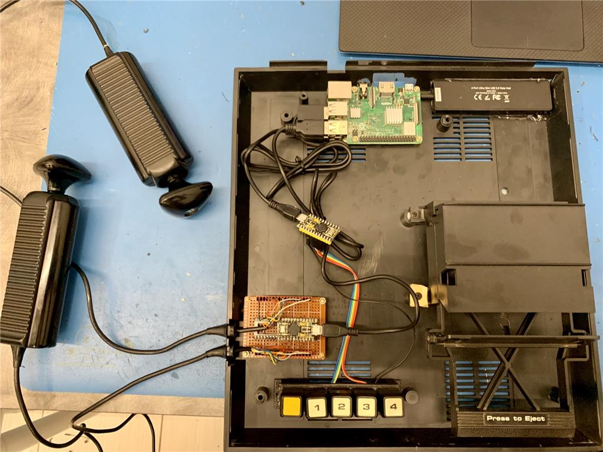
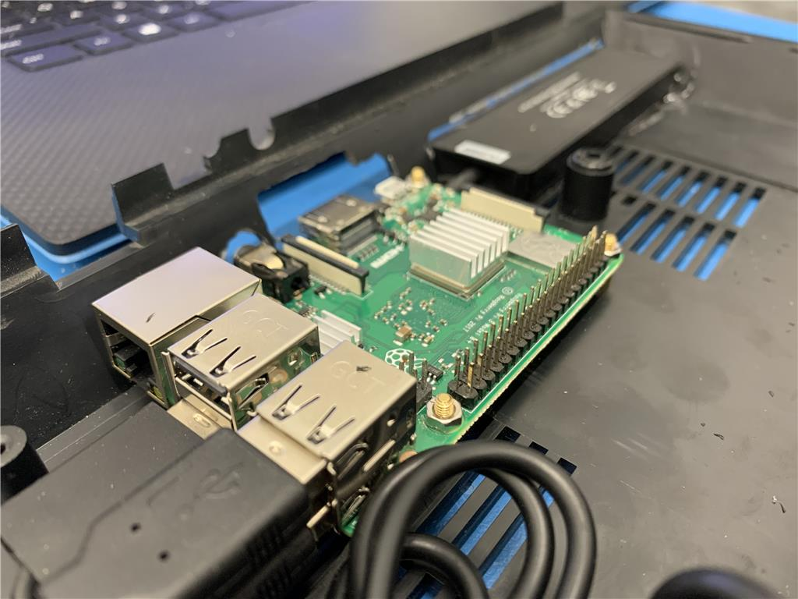
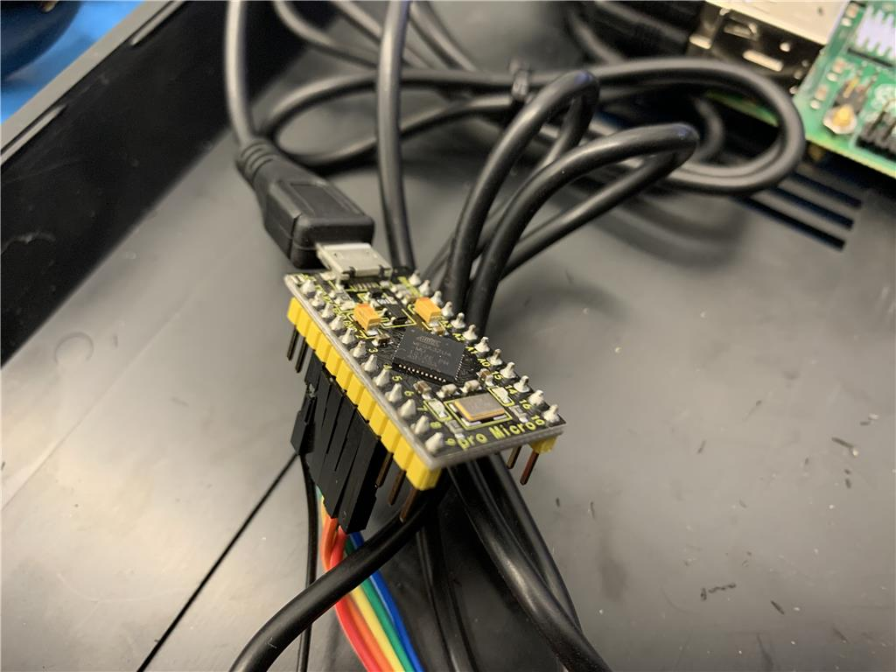
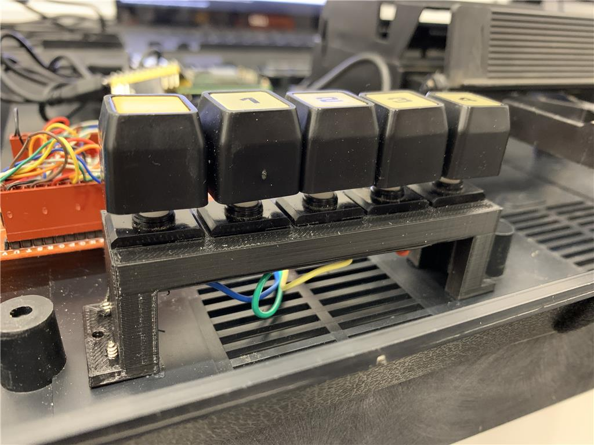
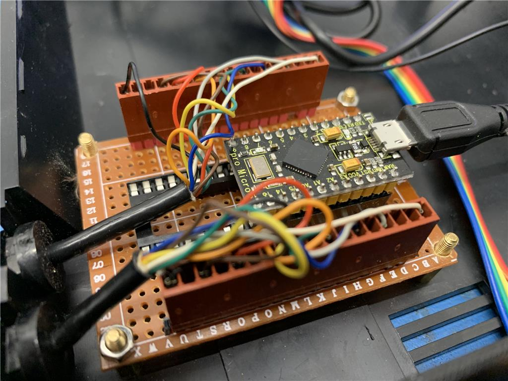

# FreeChaF
This fork is of FreeChaF with changes to use the Fairchild Channel F original controllers and console buttons connected to a raspberry pi via Arduino Micro or Leonardo. Original Repo here: https://github.com/libretro/FreeChaF

In this repo, you will find David's modified FreeChaF for real hardware, and the arduino code that emulates USB joystick and USB keyboard devices. The wiring of each controller direction to corresponding arduino i/o pin is located in the INO file.

View DJ's build live hack here: https://synthiam.com/Community/HackEvents/Hacking-decision-C64-or-Fairchild-Channel-F-18819

# Folders
/3D Printing - contains the design files for 3d printing the console button holder

/Fairchild_Pi_Joystick_Paddle_Multi - Arduino Micro firmware for the USB joystick emulator

/Fairchild_Pi_Keyboard_Switches - Arduino Micro firmware for the USB keyboard emulator that emulates the console buttons

/FreeChaF-master - The lib retro freechaf emulator src modified for real hardware

# Dj's Hacked Fairchild Example

Channel F with raspberry pi and two arduinos emulating the joysticks and console buttons

The raspberry pi mounted with stand-offs exposing the hdmi and power via a hole cut in the back of the channel f chassis

The arduino micro that emulates a USB Keyboard device and connects to the console buttons

The console buttons held with a 3d printed bracket 

The arduino micro that emulates 2 USB joysticks for the channel f joysticks

## Authors
FreeChaF was created by David Richardson.
This fork for real hardware by DJ Sures

## License
The FreeChaF core is licensed under GPLv3.

## BIOS
FreeChaF requires two BIOS files to be placed in the libretro 'system' folder:

| Filename | Description | MD5 |
|---|---|---|
| sl31253.bin | ChannelF BIOS (PSU 1) | ac9804d4c0e9d07e33472e3726ed15c3 |
| sl31254.bin | ChannelF BIOS (PSU 2) | da98f4bb3242ab80d76629021bb27585 |

If the ChannelF II BIOS is included, it will be used instead of sl31253.  All games are compatible with both.

| Filename | Description | MD5 |
|---|---|---|
| sl90025.bin | ChannelF II BIOS (PSU 1) | 95d339631d867c8f1d15a5f2ec26069d |

* BIOS filenames are case-sensitive

## Console button overlay
Access to the console buttons is provided by the Arduino. The LibRetro configuration should have the assignments of numeric values 1, 2, 3, 4 to buttons A, B, X, Z. 

## Controls
| FreeChaF Function | Retropad | Keyboard Assignment |
| --- | --- | --- |
|Forward| Left-Analog Up||
|Backward| Left-Analog Down||
|Rotate Right-Analog Left ||
|Rotate Right | Right-Analog Right ||
|Pull Up | Right-Analog Up ||
|Push Down | Right-Analog Down ||
|Show/Hide Console Overlay | Start | q |
|Controller Swap | Select | w |
|Reset | Left Trigger | R | 
|Console 1 | A | 1 |
|Console 2 | B | 2 |
|Console 3 | X | 3 | 
|Console 4 | Z | 4 |

